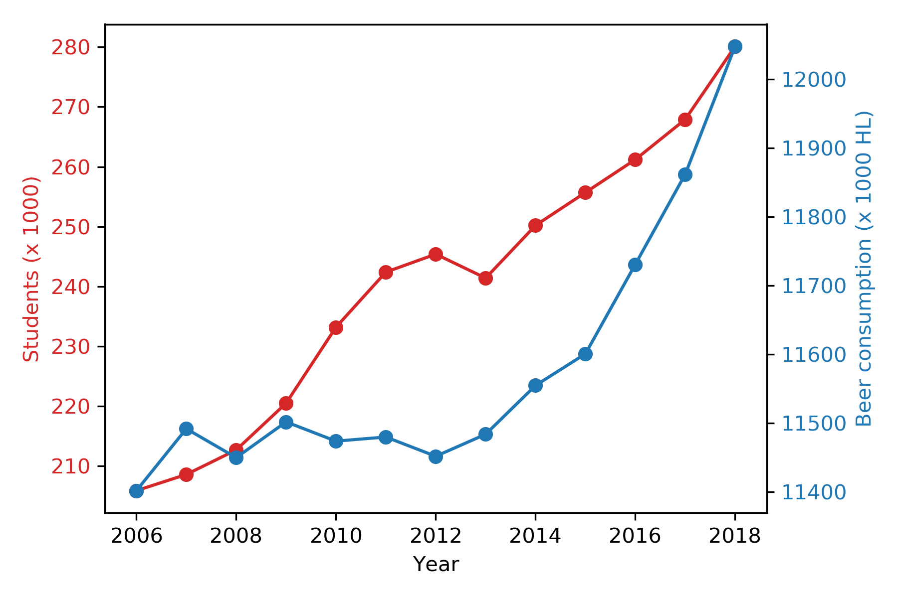
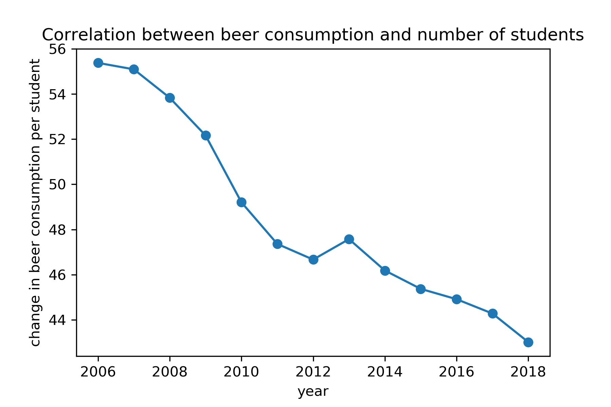

## Titles of the papers from the mentioned authors:

### 1. MCC Van Dyke et al., 2019

Title is The Rise of Coccidioides: Forces Against the Dust Devil Unleashed

### 2. JT Harvey, Applied Ergonomics, 2002

An analysis of the forces required to drag sheep over various surfaces

### 3. DW Ziegler et al., 2005

The neurocognitive effects of alcohol on adolescents and college students

## Plot of the dataset istherecorrelation.csv

